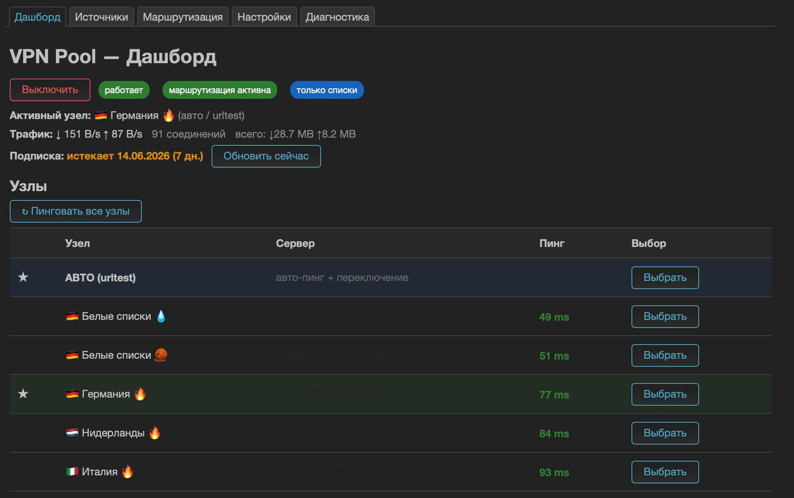
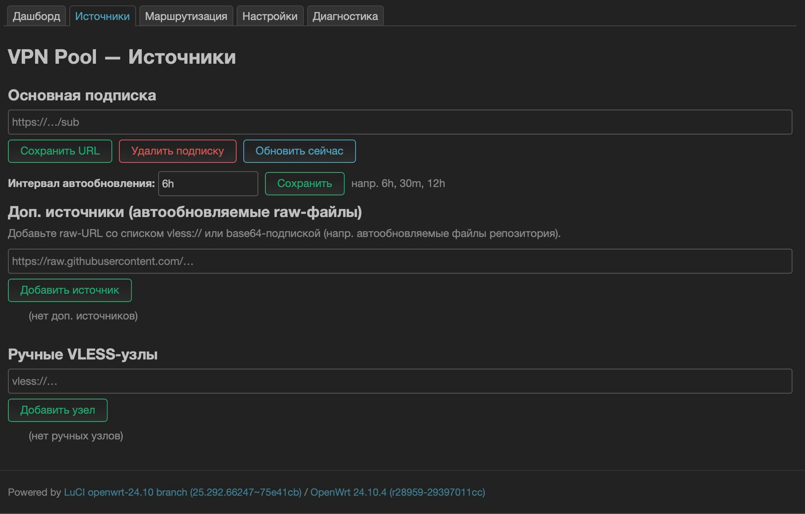
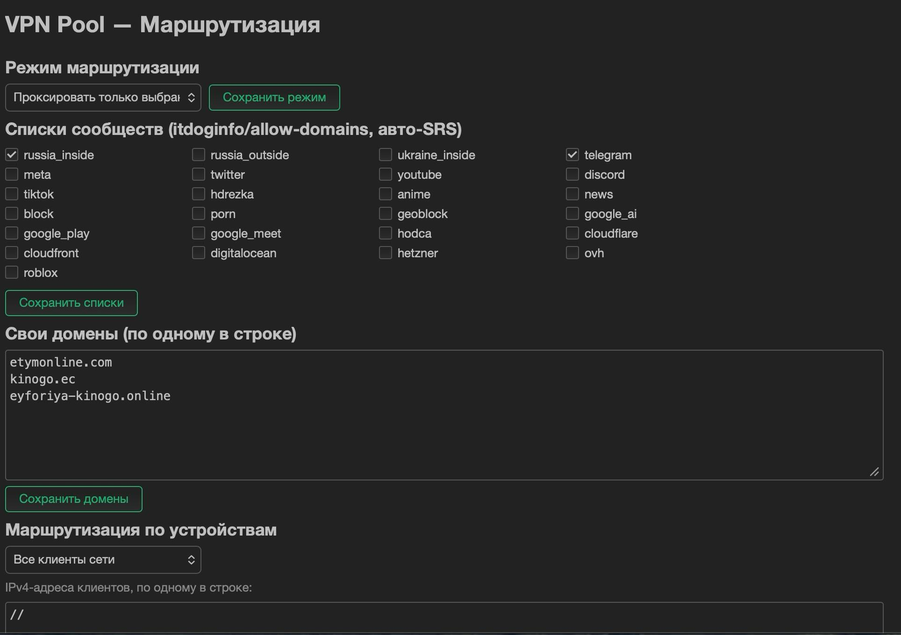
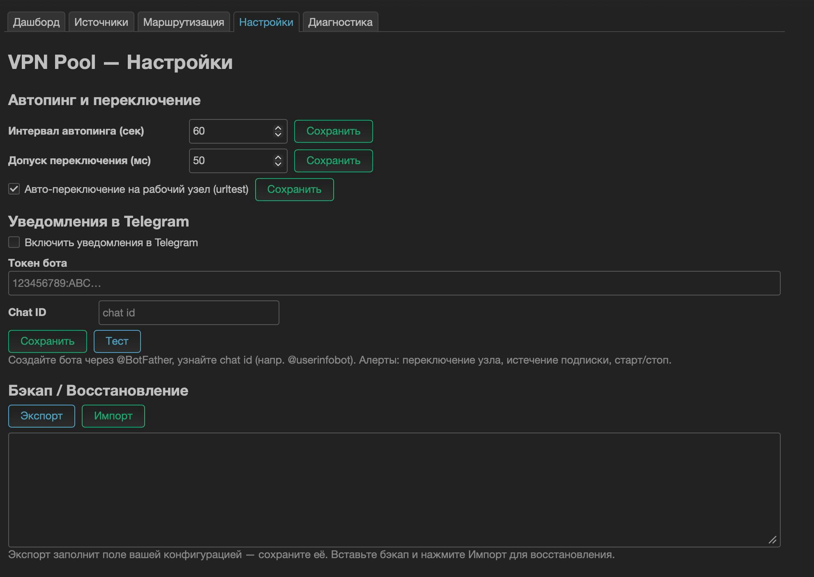

# VPN Pool (vpnpool) — VLESS subscription manager with auto‑failover for OpenWrt

<p align="right"><b>English</b> · <a href="README.ru.md">Русский 🇷🇺</a></p>

> **OpenWrt app that turns an auto‑updating VLESS/Reality subscription into an
> always‑working VPN** — like **v2RayTun / Happ, but on your router**. It pings
> all nodes, **automatically switches to a working VLESS server** when the current
> one dies, and routes your LAN (whole‑network or per‑device, selected sites or
> everything) through **sing‑box**. Manage everything from a clean LuCI dashboard.

<p align="center">
  <a href="https://github.com/roman-png/VPNpool/actions/workflows/build.yml"></a>
  
  
  
</p>

**Keywords:** OpenWrt VLESS, VLESS Reality OpenWrt, sing-box subscription, sing-box
failover, auto switch VPN router, v2RayTun for router, Happ for router, podkop
alternative, passwall alternative, vless vmess trojan shadowsocks subscription,
xtls-rprx-vision reality, urltest auto failover, обход блокировок роутер OpenWrt,
автопереключение VLESS, подписка VLESS на роутер, антизапрет sing-box.

---

## What it does

- 📡 **Auto‑updating subscription** — paste a subscription URL (base64 list **or**
  sing‑box JSON). Multiple sources supported (e.g. auto‑updating raw config files
  from a repo). **Multi‑client User‑Agent probing**: tries several client UAs but
  **stops at the first one that returns usable nodes** (only falling through to the
  next UA when a response is empty), so it keeps working if the provider serves a
  particular client — without hammering the panel with every UA.
- 🔀 **Automatic ping + failover** — sing‑box `urltest` health‑checks every node and
  **switches to a working VLESS server automatically** when the active one stops
  responding. Manual override and manual "ping all" too.
- 🩺 **Tunnel self‑heal watchdog** — the supervisor probes the tunnel end‑to‑end
  (not just the sing‑box pid); if the tunnel stays dead while WAN is up (after a
  warm‑up grace, confirmed over several probes), it restarts sing‑box and wipes the
  stale urltest cache automatically.
- 🧹 **Dead‑node prefilter** — unreachable nodes are TCP‑probed at build time and
  kept out of the auto‑ping (urltest) pool, so a churning subscription full of dead
  servers can't pile up hung probe sockets and stall pinging of the live nodes
  (they stay available for manual selection).
- 🌐 **IPv4‑first DNS strategy** — sing‑box's own health probes resolve IPv4 first
  (`dns_strategy`, default `prefer_ipv4`), so a router that gets AAAA records but has
  no IPv6 transit through the nodes doesn't show false "0 ping" for working nodes.
- 📌 **Preferred node with switch‑back** — pin a favourite node **right on the
  Dashboard** (the 📌 button on any node row): it's used while it's reachable, control
  is handed to auto if it dies, and it **switches back** when it recovers (anti‑flap
  hysteresis on top of urltest tolerance). Applied live — no tunnel bounce. The
  Dashboard keeps the **AUTO** mode lit while pinned — a soft pin biases auto, it is
  not a hard manual selection.
- 📊 **Subscription data quota** — parses the panel's `subscription‑userinfo` header
  and shows **used / total GB** with a progress bar (plus a Telegram alert when
  <10% remains), alongside the expiry date.
- 💾 **Saved nodes** — star (⭐) any node to keep it in a **separate persistent
  archive** that survives subscription expiry. Saved nodes that are no longer in the
  live subscription show up in a dedicated **“Saved (inactive)”** list on the
  dashboard; **add them back to the active pool** (or remove) with one button.
  Optional **auto‑snapshot** keeps a bounded fallback set of currently‑reachable
  nodes saved automatically (manual ⭐ picks are never evicted).
- 🔎 **Search / filter / sort nodes** — find a node by name/server, show only
  reachable ones, sort by ping/name/traffic — handy with hundreds of nodes.
- ⚡ **Per‑node real speed test** — on‑demand throughput (Mbit/s), not just ping.
- 📈 **Live per‑node & per‑client traffic** — see how much goes through each node
  and **each LAN device** (with DHCP hostnames).
- ⏰ **Scheduler** — turn the VPN on/off and refresh the subscription on a daily
  timetable (cron), e.g. off overnight, refresh every morning.
- 🔗 **Share / export nodes** — per‑node **share link + offline QR** (move a node to
  your phone), and **export** saved/manual/all nodes as a base64 subscription. QR is
  generated **client‑side** so node secrets never leave the router.
- 🧩 **Multiple subscriptions** — add extra full subscriptions that are bulk‑merged
  into the pool alongside the main one.
- 🤖 **Two‑way Telegram bot** — `/status /nodes /switch /speedtest /quota /saved
  /clients /on /off /refresh`, locked to your chat id, tunnelled through the VPN.
- 🧠 **Adaptive routing** — auto‑detects domains that are **blocked for a direct
  connection** (RST/timeout) and routes just those through the VPN, so the proxy
  list maintains itself for *your* ISP. Plus a one‑click “this site is blocked”.
- ⚡ **Smart bypass (direct DPI defeat)** — if a separate **zapret** install is
  present, one toggle switches it to **autohostlist** mode: nfqws **self‑learns**
  DPI‑blocked sites and defeats them on a **direct** connection (no proxy, so it
  survives proxy throttling). vpnpool only orchestrates the installed zapret
  (separate nft table + fwmark `0x40000000`, coexists with the tunnel) and shows
  it as detected, with the self‑learned domain count. The proxy stays for
  geo‑blocked sites that desync can’t fix. A one‑click **Install zapret** button
  fetches the upstream package for your router’s architecture and installs it
  (NFQUEUE kmods included). **Auto‑tune** finds a working desync strategy for *your*
  ISP via `blockcheck` and writes it into zapret (kicked off automatically right
  after install). A **3‑way classifier** decides per‑domain *desync‑direct* vs
  *proxy* (a geo‑block escalates to the proxy; a DPI‑block stays direct). Optional
  **anti‑throttle** auto‑engages the direct bypass when the proxy is throttled to a
  crawl. And a **Lite mode** runs zapret‑only with **no sing‑box** for tiny 16 MB
  routers (nfqws is ~1.5 MB and persists in flash).
- 🎬 **Per‑node unlock test** — check what each node opens (YouTube / ChatGPT /
  Netflix / Instagram / Telegram / Google) and see badges right in the dashboard.
- 🛡️ **Anti‑DPI** — one toggle to fragment the TLS ClientHello (sing‑box
  `tls_fragment`) and defeat SNI‑based DPI.
- 🎛️ **Configurable auto‑pool** — on the Dashboard, click **⚙ Configure** next to the
  AUTO row to pick **exactly which nodes take part in automatic switching**.
  Unchecked nodes stay available for manual selection but are never auto‑picked.
- 🧭 **Selective routing** — proxy **only chosen lists/domains** (rest direct) **or
  everything except them** (full‑VPN with exceptions). Community domain lists from
  [itdoginfo/allow‑domains](https://github.com/itdoginfo/allow-domains) as auto‑updating
  **sing‑box SRS rule‑sets** (Telegram, Russia‑inside, YouTube, Meta, Twitter/X,
  Discord, …) plus your own domains.
- 👥 **Per‑client routing** — route the whole LAN, **exclude** specific devices
  (they bypass the VPN), or allow **only** specific devices. Pick devices **by name
  from the DHCP lease list** (matched by **MAC**, so a profile survives DHCP IP
  changes); static/unknown hosts can still be added as raw IPv4.
- 🧩 **Protocols** — VLESS (Reality + `xtls‑rprx‑vision`), VMess, Trojan, Shadowsocks,
  plus sing‑box JSON configs.
- 🛡️ **Leak protection** — **IPv6 leak guard** (fail‑closed), opt‑in **kill‑switch**
  (fail‑closed IPv4 in full‑tunnel mode, so nothing leaks if the VPN drops) and
  opt‑in **DNS‑leak guard** (routes LAN DNS through the tunnel). **Clash API bound
  to loopback** (not exposed on the LAN).
- 🤝 **Coexists** with [podkop](https://github.com/itdoginfo/podkop) and zapret
  (auto‑detected, non‑colliding marks/tables/ports) — or runs **standalone**.
- 🔔 **Telegram alerts + two‑way control bot** — alerts on failover, subscription
  expiry/quota and start/stop; an optional bot accepts **/status, /nodes, /switch,
  /on, /off, /refresh** (locked to your chat id). Telegram traffic is **tunnelled
  through the VPN**, so the bot works even where `api.telegram.org` is blocked.
- 🖥️ **LuCI dashboard** (5 tabs, auto **RU/EN**): live node pings, traffic & connection
  stats, on/off, manual select, sources, routing, settings, diagnostics (incl. a real
  **"test exit via VPN"** check), backup/restore.

---

## 📸 Screenshots

| Dashboard | Sources |
|---|---|
|  |  |
| **Routing** | **Settings** |
|  |  |

---

## 🧰 Supported & recommended hardware

vpnpool itself is tiny and **architecture‑independent**. The real requirement is
**sing‑box**, which is a ~38 MB binary.

- **Minimum:** any router on **OpenWrt 23.05 / 24.10** with **≥ 128 MB RAM**. For
  storage you need room for sing‑box (~38 MB). Routers with **16 MB flash** can still
  run it — see [Routers with small flash (16 MB)](#-routers-with-small-flash-16-mb)
  to install sing‑box into RAM.
- **Recommended:** **≥ 256 MB flash** (or USB/extroot) and **≥ 512 MB RAM**, e.g.:
  - **Cudy TR3000**, **GL.iNet** Flint/Beryl, any **MediaTek Filogic** (MT7981/MT7986),
  - **Qualcomm IPQ807x** boards,
  - **x86 / x86_64** mini‑PC or VM,
  - **Raspberry Pi 4** running OpenWrt.

> **Architecture note:** our two packages ship as `_all` (one file works on **every**
> CPU). Architecture only matters for the *dependencies* (sing‑box, kmods), which
> opkg pulls from the standard OpenWrt feeds for **your** device automatically.
> Check your arch with `opkg print-architecture` if you ever need it.

### 💾 Footprint

| Component | Installed size |
|---|---|
| `vpnpool` + `luci-app-vpnpool` (our code) | **~128 KB** |
| `sing-box` (the engine) | **~38 MB** (ipk ~14 MB) |
| `jq` / `curl` / `ucode` / kmods | a few hundred KB |
| **Total with all dependencies** | **~40 MB** |

---

## 🚀 Install

### Option A — one line (recommended)

Installs (or upgrades) the latest release. Downloads the prebuilt packages from
GitHub Releases and pulls dependencies from the standard OpenWrt feeds. Your
`/etc/config/vpnpool` (subscription, Telegram, routing) is preserved on upgrade.

```sh
sh <(wget -O - https://raw.githubusercontent.com/roman-png/VPNpool/main/install.sh)
```

If your BusyBox `wget` doesn't support `<(...)`:

```sh
wget -O /tmp/vpnpool-install.sh https://raw.githubusercontent.com/roman-png/VPNpool/main/install.sh
sh /tmp/vpnpool-install.sh
```

### Option B — prebuilt `.ipk` from Releases

Our packages are arch‑independent `_all` files — **download the same two files for
any router**:

1. Grab `vpnpool_*_all.ipk` and `luci-app-vpnpool_*_all.ipk` from the
   [latest release](https://github.com/roman-png/VPNpool/releases/latest).
2. Copy them to the router and install:

```sh
opkg update
opkg install ./vpnpool_*_all.ipk ./luci-app-vpnpool_*_all.ipk
```

`sing-box`, `jq`, `curl`, `ucode` and the needed kernel modules are pulled in as
dependencies. Then open **LuCI → Services → VPN Pool**.

### Option C — opkg feed (update with `opkg update`)

The [GitHub Pages opkg feed](https://roman-png.github.io/VPNpool) is **signed**
with our usign key (fingerprint `807479500e0ce219`). Install the public key once
so opkg can verify the feed, then add it and install/upgrade like any package —
**signature checking stays on**:

```sh
# 1. install our public key (keeps opkg signature verification enabled)
wget -O /etc/opkg/keys/807479500e0ce219 https://roman-png.github.io/VPNpool/vpnpool-feed.pub
# 2. add the feed and install
echo "src/gz vpnpool https://roman-png.github.io/VPNpool" >> /etc/opkg/customfeeds.conf
opkg update
opkg install luci-app-vpnpool
```

<details>
<summary>Fallback: install without the key (disables signature checking globally)</summary>

If you don't install the key, opkg rejects the unsigned-to-it feed and drops the
package list. You can instead disable opkg's signature check — but note this turns
verification **off for every feed, including the official OpenWrt ones**, so the
key method above is preferred.

```sh
# comment out the check_signature line (NOTE: setting it to 0 is NOT enough)
sed -i '/^[[:space:]]*option[[:space:]]\+check_signature/s/^/# /' /etc/opkg.conf
opkg update
# ...later, to re-enable verification:
sed -i 's/^#[[:space:]]*\(option[[:space:]]\+check_signature\)/\1/' /etc/opkg.conf
```

</details>

### Option D — build from source (OpenWrt SDK)

```sh
# inside an OpenWrt SDK for your target
git clone https://github.com/roman-png/VPNpool package/vpnpool-src
./scripts/feeds update -a && ./scripts/feeds install -a
make package/vpnpool/compile V=s
make package/luci-app-vpnpool/compile V=s
# .ipk appear under bin/packages/<arch>/...
```

---

## 📟 Routers with small flash (16 MB)

sing‑box (~38 MB) does not fit in 16 MB of flash, but our packages do (~128 KB).
The trick (same idea podkop uses): keep vpnpool in flash and **(re)install sing‑box
into RAM (`/tmp`) on every boot**, triggered when the WAN interface comes up.

OpenWrt already defines a RAM install destination in `/etc/opkg.conf`
(`dest ram /tmp`), so `opkg install -d ram …` lands the binary under `/tmp`.

### One‑liner (16 MB flash)

Same installer as above, with `VPNPOOL_RAM_SINGBOX=1`:

```sh
VPNPOOL_RAM_SINGBOX=1 sh <(wget -O - https://raw.githubusercontent.com/roman-png/VPNpool/main/install.sh)
```

…or, if your `wget` lacks process substitution:

```sh
wget -O /tmp/vpnpool-install.sh https://raw.githubusercontent.com/roman-png/VPNpool/main/install.sh && VPNPOOL_RAM_SINGBOX=1 sh /tmp/vpnpool-install.sh
```

It installs zram‑swap, the lightweight deps and our packages into flash
(`--nodeps`, no sing‑box), writes the WAN‑up boot hook, and installs sing‑box into
RAM right away. Then set your subscription in **LuCI → Services → VPN Pool** and run
`/etc/init.d/vpnpool start`. On every reboot the hook reinstalls sing‑box into RAM
and starts vpnpool automatically. If your WAN isn't named `wan`, edit `INTERFACE`
in `/etc/hotplug.d/iface/99-vpnpool-singbox-ram`.

> **Updating on small flash:** re‑run the same one‑liner. Do **not** use `opkg upgrade`
> here — it resolves the `sing-box` dependency against flash and would try to pull the
> ~38 MB binary into ROM (the install deliberately uses `--nodeps` to avoid that).

<details>
<summary>Manual steps (what the one‑liner does under the hood)</summary>

**1. Install zram‑swap** (gives the small router more usable memory for `opkg`):

```sh
opkg update
opkg install zram-swap
/etc/init.d/zram enable
/etc/init.d/zram start
```

**2. Install vpnpool itself, but WITHOUT sing‑box** (it won't fit in flash). Install
the small dependencies normally, then our packages with `--nodeps`:

```sh
opkg update
opkg install jq curl ucode ucode-mod-fs ucode-mod-uci kmod-nft-tproxy ip-full ca-bundle
# get the two _all .ipk (e.g. via the release page or install.sh's download step), then:
opkg install --nodeps ./vpnpool_*_all.ipk ./luci-app-vpnpool_*_all.ipk
```

**3. Do NOT autostart vpnpool at boot** — sing‑box won't exist yet. The hotplug hook
below starts it after sing‑box is in place:

```sh
/etc/init.d/vpnpool disable
```

**4. Create the boot hook** that installs sing‑box into RAM and starts vpnpool when
the WAN comes up (runs on every reboot, needs internet):

```sh
cat > /etc/hotplug.d/iface/99-vpnpool-singbox-ram <<'EOF'
#!/bin/sh
[ "$ACTION" = "ifup" -a "$INTERFACE" = "wan" ] && {
    logger -t vpnpool "WAN up: installing sing-box into RAM"
    opkg update
    opkg install -d ram --force-reinstall --force-overwrite sing-box
    ln -sf /tmp/usr/bin/sing-box /usr/bin/sing-box
    /etc/init.d/vpnpool start
    logger -t vpnpool "sing-box installed in RAM, vpnpool started"
}
EOF
chmod +x /etc/hotplug.d/iface/99-vpnpool-singbox-ram
```

**5. Reboot (or replug WAN) and verify:**

```sh
logread -e vpnpool        # should show "sing-box installed in RAM, vpnpool started"
sing-box version          # confirms the RAM symlink resolves
```

</details>

> **Trade‑offs:** sing‑box (~14 MB ipk) is re‑downloaded into RAM on every boot, so
> the router needs working internet at startup and enough free RAM (~128 MB+). If
> your WAN is named differently (e.g. `wan6`, `wwan`), adjust the `INTERFACE` check.
>
> **Tested on:** Xiaomi Mi Router 4A Gigabit (MediaTek MT7621, 16 MB flash / 128 MB
> RAM, OpenWrt 24.10) — fresh one‑liner install, reboot, and live VPN exit all OK.
>
> **Keep a single boot hook.** Only one WAN‑up hook may install sing‑box into RAM.
> Two hooks racing `opkg install -d ram sing-box` on a 128 MB router OOM each other
> and corrupt the binary (symptom: `sing-box: Bus error` / `Permission denied`). The
> one‑liner removes stale `*vpnpool*` iface hooks before writing its own, so just
> don't add a second one by hand.

---

## ⚙️ Quick start

1. **Sources** tab → paste your subscription URL → **Update now**.
2. **Routing** tab → pick mode (proxy selected / proxy all‑except) → choose community
   lists and/or add domains.
3. **Dashboard** → **Turn ON**. Watch live pings; the green ★ is the active node.
   Use **⚙ Configure** on the AUTO row to choose which nodes auto‑switch.
4. **Diagnostics** → **Test exit via VPN** to confirm your real exit IP/country.

CLI equivalent:

```sh
uci set vpnpool.main.subscription_url='https://example.com/sub'
uci set vpnpool.main.enabled='1'; uci commit vpnpool
/etc/init.d/vpnpool enable; /etc/init.d/vpnpool restart
```

---

## 🧠 How it works

```
LuCI (5 tabs) ── ubus/rpcd ── vpnpoold (ucode + shell, procd)
                                  │ fetch (multi-UA) → parse → generate → sing-box check
                                  ▼
                          sing-box (the engine)
   inbound: tproxy 127.0.0.1:1603  +  local mixed SOCKS/HTTP :1605 (test/apps)
   outbound: urltest "auto" (ping + failover) + selector + nodes + direct
   route: sniff SNI → community SRS / domains → proxy (or direct in exclude mode)
                                  ▲
   nftables (table inet vpnpool): mark LAN 80/443 → fwmark 0x400000 → table 142 →
   tproxy; yields to podkop; IPv6 fail-closed; per-client include/exclude
```

The control plane (subscription, parsing, config generation, watchdog, UI) is ours;
the data plane is **sing‑box**, exactly like v2RayTun/Happ wrap an engine.

---

## 🆚 Compared to podkop / passwall / homeproxy

| | **vpnpool** | podkop | passwall2 | homeproxy |
|---|---|---|---|---|
| Engine | sing‑box | sing‑box | xray/sing‑box | sing‑box |
| Auto‑updating subscription | ✅ multi‑source, multi‑UA | partial | ✅ | ✅ |
| **Auto ping + failover** | ✅ urltest + watchdog | manual select | ✅ | ✅ |
| **Preferred node + switch‑back** | ✅ | — | — | — |
| **Pick which nodes auto‑switch** | ✅ | — | — | — |
| **Subscription data quota** | ✅ used/total + bar | — | — | — |
| **Saved nodes (survive expiry)** | ✅ | — | — | — |
| **Per‑node speed test** | ✅ throughput | — | — | — |
| **Per‑node & per‑client stats** | ✅ live | — | partial | partial |
| **On/off + refresh scheduler** | ✅ | — | — | — |
| **Share link + offline QR / export** | ✅ | — | — | — |
| **Multiple full subscriptions** | ✅ | — | partial | ✅ |
| **Two‑way Telegram control bot** | ✅ | — | — | — |
| **Adaptive routing (auto‑detect blocks)** | ✅ | — | — | — |
| **Per‑node unlock test (YT/AI/NF…)** | ✅ | — | — | — |
| **Anti‑DPI TLS fragmentation** | ✅ toggle | — | — | — |
| **Kill‑switch + DNS‑leak guard** | ✅ opt‑in | partial | ✅ | partial |
| Community SRS lists | ✅ (itdoginfo) | ✅ | own | own |
| Per‑client routing | ✅ | — | ✅ | partial |
| VPN‑exit self‑test | ✅ | ✅ | partial | — |
| Telegram alerts | ✅ | — | — | — |
| **Two‑way Telegram control bot** | ✅ (tunnelled) | — | — | — |
| Coexists with podkop | ✅ (by design) | n/a | — | — |
| Auto RU/EN UI | ✅ | RU/EN | RU/EN | EN/ZH |

---

## 🔐 Notes

- **DNS:** routing is done by **SNI sniffing**, so DNS games aren't required. On a
  fresh OpenWrt this just works with the system resolver. If you previously ran
  podkop and remove it, restore dnsmasq's normal upstream (podkop points it at its
  own `127.0.0.42` fake‑IP resolver).
- **GitHub reachability:** community SRS rule‑sets are downloaded from GitHub
  releases; if blocked, route GitHub through the proxy first.
- **Security:** the Clash API is bound to `127.0.0.1` only.

## 🗺️ Roadmap

- Near‑instant active‑probe failover (below the urltest interval)
- Full sing‑box DNS/FakeIP with DoH‑over‑proxy for fully leak‑free selective routing
  (current DNS guard covers LAN clients that query public resolvers directly)
- Full IPv6 tproxy (proxy mode, not just block)
- Clash YAML subscription parsing
- Multi‑hop / chain proxy (entry in one country, exit in another)

## 🤝 Contributing

Issues and PRs welcome. The whole thing is ucode + shell + a little LuCI JS — no
compilation needed.

## 📄 License

[GPL‑3.0‑only](LICENSE) © 2026 roman‑png
