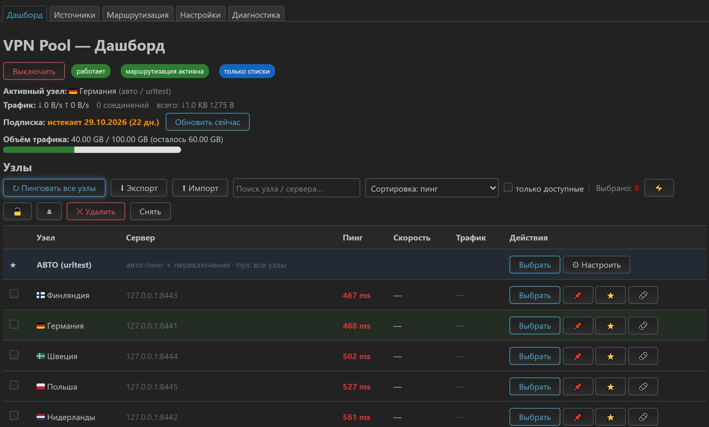
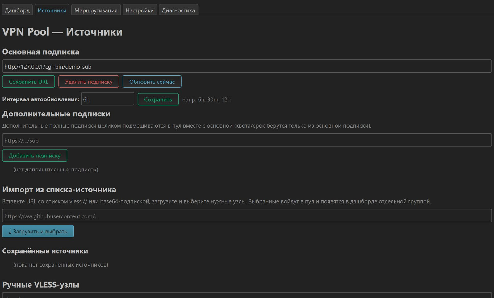
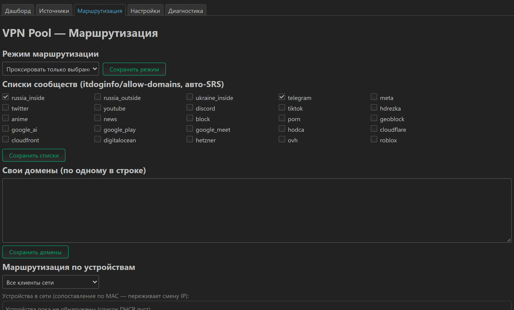
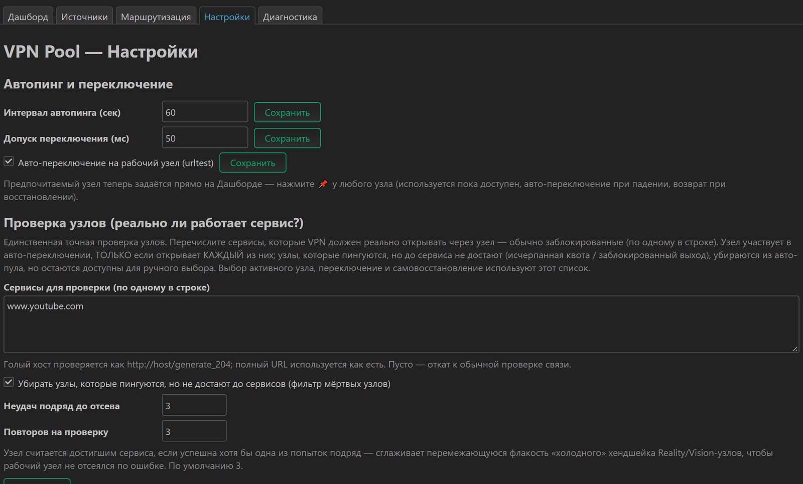

# VPNpool — менеджер подписок VLESS / Reality с авто-переключением для OpenWrt (sing-box + AmneziaWG)

<p align="right"><a href="README.md">English 🇬🇧</a> · <b>Русский</b></p>

> **Приложение для OpenWrt, которое превращает автообновляемую подписку VLESS / Reality
> во всегда рабочий VPN** — как **v2RayTun или Happ, только на вашем роутере**. Оно
> проверяет каждый узел по тем сервисам, которые нужны именно вам, **само переключается
> на рабочий сервер**, когда активный отваливается, и заворачивает трафик сети (всю
> сеть или отдельные устройства, выбранные сайты или всё) через **sing-box**. Узлы
> **AmneziaWG** (обфусцированный WireGuard) живут в том же пуле. Управление — из
> аккуратного веб-интерфейса LuCI, из Telegram-бота или обычным `uci`.

<p align="center">
  <a href="https://github.com/roman-png/VPNpool/actions/workflows/build.yml"></a>
  <a href="https://github.com/roman-png/VPNpool/releases/latest"></a>
  
  
  
  
</p>

---

## Содержание

- [Зачем это нужно](#зачем-это-нужно)
- [Возможности](#возможности)
  - [Подписки и узлы](#подписки-и-узлы)
  - [Проверка узлов, failover и самовосстановление](#проверка-узлов-failover-и-самовосстановление)
  - [AmneziaWG (обфусцированный WireGuard)](#amneziawg-обфусцированный-wireguard)
  - [Маршрутизация](#маршрутизация)
  - [Безопасность и защита от утечек](#безопасность-и-защита-от-утечек)
  - [Мониторинг, управление и автоматизация](#мониторинг-управление-и-автоматизация)
  - [Интерфейс LuCI: пять вкладок](#интерфейс-luci-пять-вкладок)
- [Скриншоты](#-скриншоты)
- [Поддерживаемое железо](#-поддерживаемое-и-рекомендуемое-железо)
- [Установка](#-установка)
- [Роутеры с малым объёмом флеш (16 МБ)](#-роутеры-с-малым-объёмом-флеш-16-мб)
- [Быстрый старт](#️-быстрый-старт)
- [Как это работает](#-как-это-работает)
- [Справочник настроек (uci)](#️-справочник-настроек-uci)
- [Сравнение с podkop / passwall / homeproxy](#-сравнение-с-podkop--passwall--homeproxy)
- [Частые вопросы](#-частые-вопросы)
- [Что делать, если не работает](#-что-делать-если-не-работает)
- [Ограничения и замечания](#-ограничения-и-замечания)
- [Планы](#️-планы)
- [Разработка](#️-разработка)

---

## Зачем это нужно

Клиенты на телефоне (v2RayTun, Happ, Hiddify) сами пингуют всю подписку и переходят на
живой сервер. Роутерные пакеты так обычно не умеют: вы вставляете один узел, он умирает —
и вся квартира без интернета, пока вы не зайдёте в LuCI.

vpnpool — это тот самый недостающий control-plane. Он держит **всю подписку** как пул,
решает, какие узлы реально пригодны, **открывая перечисленные вами сайты** (а не только
по пингу), поддерживает пул в форме в фоне и никогда не оставляет сеть заведённой
в мёртвый туннель.

---

## Возможности

### Подписки и узлы

- 📡 **Автообновляемая подписка** — вставьте URL (список base64 **или** JSON sing-box).
  **Перебор клиентских User-Agent**: пробуется девять UA, побеждает **первый, вернувший
  узлы** (к следующему переходим только на пустом ответе) — панели, отдающие данные
  только «настоящим» клиентам, работают, и при этом их не долбят всеми UA подряд. Если
  запрос провалился совсем, поднимается офлайн-кэш, а когда кэшу 3+ дня — приходит
  предупреждение в Telegram.
- 🧩 **Несколько подписок** — дополнительные полные подписки подмешиваются в тот же пул
  (при добавлении показывается, сколько узлов приехало, или HTTP-код при неудаче).
- 🔎 **Импорт из источника** — укажите любой список ссылок: vpnpool в фоне скачает его
  только на чтение, пропингует серверы и покажет **модалку выбора** (Все доступные / Все
  / Никакие) — до того, как что-то будет импортировано. Сохранённые источники обновляются
  кнопкой ⟳.
- ✍️ **Ручные узлы и массовый импорт** — одна ссылка `vless://`, пачка ссылок,
  base64-подписка или файл `.txt`.
- 🧩 **Протоколы** — VLESS (Reality + `xtls-rprx-vision`), VMess, Trojan, Shadowsocks и
  готовые JSON-конфиги sing-box (оттуда подхватываются и outbound'ы Hysteria/TUIC), плюс
  [AmneziaWG](#amneziawg-обфусцированный-wireguard).
- 💾 **Сохранённые узлы** — отметьте узел звездой (⭐), и он попадёт в **отдельный
  постоянный архив**, переживающий окончание подписки. Те сохранённые, которых уже нет в
  живой подписке, показываются списком **«Сохранённые (неактивные)»**, и одной кнопкой
  возвращаются в активный пул. Опциональный **авто-снимок** сам держит ограниченный
  резервный набор доступных узлов (ручные ⭐ никогда не вытесняются). Удаление узлов —
  даже массовое — этот архив не трогает.
- 🗑️ **Управление узлами** — чекбоксы и массовое удаление (одна пересборка на всё
  выделение), удаление и деактивация по строке. Удалённый узел подписки скрывается и не
  возвращается при обновлении; удаление **всей подписки** убирает её узлы и
  **автоматически активирует сохранённые**, чтобы роутер остался на связи.
- 🔗 **Шеринг и экспорт** — у каждого узла ссылка и **офлайн-QR** (перенос на телефон),
  экспорт сохранённых / ручных / всех узлов как base64-подписки. QR рисуется **в
  браузере**, секреты узлов роутер не покидают.
- 📊 **Остаток трафика подписки** — разбирается заголовок `subscription-userinfo`,
  показываются **использовано / всего ГБ** с прогресс-баром и срок действия (плюс алерт в
  Telegram, когда осталось меньше 10 %).
- 🔎 **Поиск, фильтр, сортировка** — найти узел по имени или серверу, показать только
  доступные, отсортировать по пингу / имени / трафику. Незаменимо, когда узлов сотни.

### Проверка узлов, failover и самовосстановление

- 🎯 **Проверка по реальным сервисам** — вы перечисляете, **какие сервисы обязаны
  открываться** (`www.youtube.com`, по одному в строке, в *Настройки → Проверка узлов*), и
  **это единственный критерий** пригодности узла. Каждый узел проверяется насквозь через
  Clash delay API по *вашим* сервисам и остаётся в авто-переключении, только если
  открывает **все** до одного. Именно так отсеиваются узлы «**пингуется, а сервис
  мёртв**» — заглушки протухших аккаунтов, выходы с исчерпанной квотой или гео-блоком,
  которые отвечают по TCP и даже достают до CDN, но не везут нужный вам трафик. **Тот же
  набор сервисов** управляет urltest, failover и watchdog — вся система одинаково
  понимает, что значит «работает». Узел выбывает только после нескольких провалов подряд
  (защита от дёрганья, число страйков и ретраев настраивается), остаётся доступен для
  ручного выбора, и пул никогда не опустошается. Пустой список — откат на обычную
  проверку связности.
- 🔀 **Авто-пинг + переключение** — `urltest` sing-box проверяет пул и переключается на
  рабочий узел, когда активный перестаёт отвечать. Есть и ручной выбор, и ручной
  «пинг всех».
- 🩺 **Watchdog самовосстановления** — супервизор проверяет туннель насквозь (а не только
  pid sing-box); если он держится мёртвым при живом WAN (после grace-прогрева,
  подтверждённо несколькими пробами), sing-box перезапускается, а протухший кэш urltest
  сбрасывается.
- 🚦 **Fail-safe маршрутизация (1.4.3)** — сеть **никогда** не заворачивается в туннель,
  который не доказал свою работоспособность. На старте vpnpool ждёт реальной сквозной
  пробы; если ни один узел не ответил (пустая или протухшая подписка, все выходы мертвы),
  правила nft **не ставятся вовсе** — LAN продолжает работать напрямую, в лог пишется
  честная причина, в Telegram уходит уведомление. Фоновая проверка каждые 15 с поднимает
  маршрутизацию в тот момент, когда узел оживёт. Та же проверка стоит на каждой
  перезагрузке конфига.
- 🧹 **Отсев мёртвых узлов** — недоступные серверы проверяются по TCP батчами при сборке и
  не попадают в пул urltest: подписка с кучей мёртвых хостов не копит висящие сокеты проб
  и не глушит пинг живых узлов (для ручного выбора они остаются).
- 📌 **Приоритетный узел с возвратом** — закрепите любимый узел прямо на Дашборде (📌 в
  строке узла): он используется, пока доступен, при падении управление уходит авто-режиму,
  а после восстановления **возвращается обратно** (гистерезис поверх tolerance urltest).
  Применяется на лету, без перезапуска туннеля. Пин снимается сам, если тег исчез из
  подписки или попал в мёртвый набор.
- 🎛️ **Настраиваемый авто-пул** — **⚙ Настроить** у строки АВТО выбирает, какие именно
  узлы участвуют в авто-переключении. Невыбранные остаются доступны вручную, но
  автоматически не берутся никогда. Выбывшие и исключённые узлы живут в собственном
  списке **«Вне авто-пула»** с кнопкой **↩ Вернуть в авто** (принудительно возвращённый
  помечается ★ и позже может быть отдан обратно фильтру).
- 🌐 **DNS со стратегией IPv4** — собственные health-пробы sing-box резолвятся сначала по
  IPv4 (`dns_strategy`, по умолчанию `prefer_ipv4`), чтобы роутер, получающий AAAA без
  IPv6-транзита через узлы, не показывал ложный «0 пинга» у рабочих узлов.
- ⚡ **Тест реальной скорости узла** — по требованию, в Мбит/с, а не только пинг (с
  проверкой свободной памяти, чтобы не уронить 16 МБ-роутер).
- 🎬 **Unlock-тест по узлам** — что именно открывает каждый узел (YouTube / ChatGPT /
  Netflix / Instagram / Telegram / Google), бейджи прямо в строке узла.

### AmneziaWG (обфусцированный WireGuard)

AmneziaWG проходит DPI мобильных операторов в РФ там, где хендшейк TLS/Reality
сбрасывается, поэтому vpnpool считает его **полноценным членом пула**, а не отдельным
режимом:

- **Импортируйте** `.conf` AmneziaWG **или ссылку AmneziaVPN `vpn://`** на вкладке
  **Источники**. `vpn://` декодируется **на роутере** (свой inflate RFC 1951 на чистом
  ucode — в OpenWrt нет zlib-CLI): ни приложения Amnezia, ни онлайн-декодеров, ничего не
  уходит наружу.
- **Учитываются все поля AWG**: `Jc/Jmin/Jmax`, `S1–S4`, магические заголовки `H1–H4`
  (включая диапазоны `lo-hi` из AWG 2.x), `I1–I5`, `PresharedKey`, `PersistentKeepalive`,
  `MTU` (по умолчанию 1280, если заданы S3/S4), несколько адресов в `Address`.
- **Один пул, одна логика** — узел AWG участвует в том же авто-переключении `urltest`, той
  же проверке по сервисам и том же watchdog, что и VLESS. Он освобождён только от
  TCP-префильтра (та проба говорит по HTTPS и не видит UDP-эндпоинт), поэтому исправный
  AWG-узел не выбывает по ложной причине.
- Узлы хранятся отдельными файлами в `/etc/vpnpool/awg/*.conf`, получают свою секцию
  **«Узлы AmneziaWG»** в Источниках и группу **AmneziaWG** на Дашборде, а удаляются
  надёжно — по тегу.
- В конфиге они становятся элементами верхнеуровневого **`endpoints[]`** (в sing-box ≥ 1.13
  WireGuard — это не outbound).
- ⚙️ **Нужен форк sing-box с AWG** — ставится флагом `VPNPOOL_AWG=1` (см.
  [Установку](#-установка)). На стоковом sing-box **весь интерфейс AmneziaWG скрыт**
  (демон кэширует возможности бинаря и отдаёт их в UI), так что при обычной установке вы
  не увидите мёртвых кнопок.

### Маршрутизация

- 🧭 **Выборочная маршрутизация** — проксировать **только выбранные списки/домены**
  (остальное напрямую) **или всё, кроме них** (полный VPN с исключениями). **26 списков
  доменов** от [itdoginfo/allow-domains](https://github.com/itdoginfo/allow-domains)
  подключаются как автообновляемые **SRS rule-set'ы sing-box** (Telegram, Россия, YouTube,
  Meta, Twitter/X, Discord, …), плюс ваши собственные домены.
- 👥 **Маршрутизация по устройствам** — вся сеть, **исключить** конкретные устройства (идут
  мимо VPN) или разрешить **только** определённые. Устройства выбираются **по имени из
  списка аренд DHCP** и сопоставляются по **MAC**, поэтому профиль переживает смену IP, а
  выключенные устройства остаются в списке; статические и неизвестные хосты можно добавить
  как IPv4 вручную.
- 🧠 **Адаптивная маршрутизация** — vpnpool смотрит, какие хосты ходят напрямую, сравнивает
  для новых «напрямую против прокси» и заворачивает в VPN именно те, что заблокированы для
  прямого соединения (RST/таймаут) — список ведёт себя сам под вашего провайдера. Плюс
  поле «этот сайт не открывается» в один клик.
- 🛡️ **Анти-DPI, три уровня** — **выкл / вкл** (`tls_fragment` в sing-box: TLS ClientHello
  режется, и DPI по открытому SNI не может его сопоставить) **/ агрессивный** (ещё и
  `tls_record_fragment`). Помогает только против *базовой* фильтрации; против устойчивой
  цензуры (DPI класса ТСПУ) ставьте рядом [zapret](https://github.com/bol-van/zapret) —
  vpnpool с ним уживается и показывает его в Диагностике.
- 🤝 **Уживается** с [podkop](https://github.com/itdoginfo/podkop) и zapret —
  непересекающиеся fwmark, таблица маршрутизации, tproxy-порт, nft-таблица и порт Clash
  API, а nft-цепочка явно уступает трафик, уже помеченный podkop. Либо работает
  автономно.

### Безопасность и защита от утечек

- 🛡️ **Защита от утечки IPv6** (fail-closed: форвардинг IPv6 из LAN режется, пока туннель
  только IPv4), опциональный **kill-switch** (fail-closed IPv4 в режиме полного туннеля:
  умер sing-box — помеченный трафик умирает вместе с ним, а не утекает), опциональная
  **защита от DNS-утечек** (порт 53 из LAN идёт через туннель).
- 🔐 **Clash API только на loopback** (`127.0.0.1:9091`), в LAN не виден.
- 🔁 **Откат конфига** — каждый сгенерированный конфиг проходит `sing-box check`; битая
  подписка или один кривой узел не уронят туннель (проблемный `outbound[N]`/`endpoint[N]`
  выбрасывается и сборка повторяется, а непригодный результат откатывается на прошлый
  конфиг).

### Мониторинг, управление и автоматизация

- 📈 **Живой трафик по узлам и устройствам** — сколько идёт через каждый узел и каждое
  устройство сети (с именами из DHCP), плюс число соединений и текущая скорость.
- 🤖 **Двусторонний Telegram-бот** — **меню на inline-кнопках** (`/menu`): переключить
  узел, замерить скорость, включить/выключить маршрутизацию, посмотреть
  статус / квоту / клиентов. Слэш-команды тоже работают
  (`/status /nodes /switch /speedtest /quota /saved /clients /on /off /refresh /help`),
  доступ только с вашего chat id, трафик идёт через туннель — бот жив даже там, где
  `api.telegram.org` заблокирован. Бот работает **отдельной procd-службой**, а `/on` и
  `/off` трогают только *маршрутизацию* — туннель (а значит, и сам бот) остаётся жив.
- 🔔 **Уведомления в Telegram** — переключение узла, срок и квота подписки, старт/стоп,
  подъём и падение маршрутизации, протухший офлайн-кэш.
- ⏰ **Планировщик** — включение/выключение VPN и обновление подписки по расписанию
  (пишется отдельным помеченным блоком в root-crontab).
- 🧪 **Диагностика** — состояние службы, сосуществование с podkop/zapret, WAN и прямой
  выходной IP/страна, кэш SRS-списков, ресурсы, последние 40 строк лога и настоящая
  проверка **«выход через VPN»** по нескольким IP-эхо-сервисам (один, блокирующий
  дата-центры, не даст ложного провала).
- 💾 **Бэкап и восстановление** всей конфигурации на вкладке Настройки.

### Интерфейс LuCI: пять вкладок

Авто **RU/EN** (по языку браузера), адаптивная вёрстка, опрос дашборда раз в 5 с:

| Вкладка | Что на ней |
|---|---|
| **Дашборд** | Вкл/выкл, активный узел, трафик и соединения, срок подписки и бар остатка трафика, пинг всех, импорт/экспорт, поиск/сортировка/фильтр, таблица узлов (строка АВТО + ⚙ авто-пул, 📌 приоритет, ⭐ сохранение, 🔗 ссылка+QR, unlock-бейджи, скорость), массовое выделение и удаление, «Сохранённые (неактивные)», «Вне авто-пула», трафик по устройствам |
| **Источники** | Основная подписка и интервал обновления, дополнительные подписки, разведка источника с модалкой выбора узлов, ручные узлы и массовый импорт, **узлы AmneziaWG** (когда установлен форк), архив сохранённых |
| **Маршрутизация** | Режим маршрутизации, 26 списков сообществ, свои домены, режим по устройствам с выбором из DHCP и дополнительными IPv4 |
| **Настройки** | Интервал/tolerance/авто-переключение failover, проверка узлов (сервисы, фильтр, страйки, ретраи), kill-switch и защита DNS, анти-DPI и адаптивная маршрутизация, авто-снимок, расписание, Telegram, бэкап/восстановление, технические значения только для чтения |
| **Диагностика** | Служба, сосуществование, сеть и прямой выход, тест выхода через VPN, кэш rule-set'ов, ресурсы, свежие логи |

---

## 📸 Скриншоты

| Дашборд — живые пинги, активный узел, трафик | Источники — подписки, ручные узлы и AmneziaWG |
|---|---|
|  |  |
| **Маршрутизация — выборочный режим, списки, устройства** | **Настройки — failover, проверка узлов, Telegram** |
|  |  |

---

## 🧰 Поддерживаемое и рекомендуемое железо

Само vpnpool крошечное и **не зависит от архитектуры**. Реальное требование — это
**sing-box**, бинарь ~38 МБ.

- **Минимум:** любой роутер на **OpenWrt 23.05 / 24.10** с **≥ 128 МБ ОЗУ** и местом под
  sing-box (~38 МБ). Роутеры с **16 МБ флеш** тоже подойдут — см.
  [Роутеры с малым объёмом флеш](#-роутеры-с-малым-объёмом-флеш-16-мб), там sing-box
  ставится в ОЗУ.
- **Рекомендуется:** **≥ 256 МБ флеш** (или USB/extroot) и **≥ 512 МБ ОЗУ**, например:
  - **Cudy TR3000**, **GL.iNet** Flint / Beryl, любой **MediaTek Filogic** (MT7981/MT7986),
  - платы **Qualcomm IPQ807x**,
  - **x86 / x86_64** мини-ПК или ВМ,
  - **Raspberry Pi 4** с OpenWrt.
- **AmneziaWG** дополнительно требует форк sing-box, пребилды есть только для **aarch64**
  и **mipsel** (на прочих архитектурах остаётся стоковый бинарь, а интерфейс AWG скрыт).

> **Про архитектуру:** наши два пакета поставляются как `_all` (один файл работает на
> **любом** CPU). Архитектура важна только для *зависимостей* (sing-box, kmod'ы), которые
> opkg сам подтянет из штатных фидов OpenWrt под **ваше** устройство. Узнать свою:
> `opkg print-architecture`.

### 💾 Объём установки

| Компонент | Размер на диске |
|---|---|
| `vpnpool` + `luci-app-vpnpool` (наш код) | **~128 КБ** |
| `sing-box` (движок) | **~38 МБ** (ipk ~14 МБ) |
| `jq` / `curl` / `ucode` / kmod'ы | несколько сотен КБ |
| **Итого со всеми зависимостями** | **~40 МБ** |

---

## 🚀 Установка

### Вариант A — одной строкой (рекомендуется)

Ставит (или обновляет) последний релиз: готовые пакеты из GitHub Releases, зависимости —
из штатных фидов OpenWrt. Ваш `/etc/config/vpnpool` (подписка, Telegram, маршрутизация)
при обновлении сохраняется.

**Обычный** — VLESS / VMess / Trojan / Shadowsocks на стоковом sing-box:

```sh
sh <(wget -O - https://raw.githubusercontent.com/roman-png/VPNpool/main/install.sh)
```

**С AmneziaWG** — дополнительно заменяет sing-box на форк с AWG
([hoaxisr/amnezia-box](https://github.com/hoaxisr/amnezia-box); бинарь сверяется с
`checksums.txt` того же релиза, а если этот файл скачать не удалось — установщик
предупреждает) и фиксирует его через `opkg flag hold`, чтобы `opkg upgrade` не подменил
его обратно:

```sh
VPNPOOL_AWG=1 sh <(wget -O - https://raw.githubusercontent.com/roman-png/VPNpool/main/install.sh)
```

Если ваш BusyBox `wget` не поддерживает `<(...)`, сначала скачайте, потом запустите (для
варианта с AmneziaWG добавьте ту же переменную перед `sh`):

```sh
wget -O /tmp/vpnpool-install.sh https://raw.githubusercontent.com/roman-png/VPNpool/main/install.sh
sh /tmp/vpnpool-install.sh
```

**Переменные окружения установщика:**

| Переменная | Что делает |
|---|---|
| `VPNPOOL_AWG=1` | Ставит форк sing-box с AmneziaWG вместо стокового (пребилды aarch64 / mipsel; на других архитектурах остаётся сток с предупреждением) |
| `VPNPOOL_RAM_SINGBOX=1` | Режим 16 МБ флеш: sing-box ставится в ОЗУ при каждой загрузке (см. ниже) |
| `VPNPOOL_VERSION=v1.4.3` | Поставить конкретный тег релиза вместо `latest` |

> ⚠ **podkop использует тот же `/usr/bin/sing-box`.** Если podkop установлен, вариант с
> AWG заставит и его работать на форке. Это работает, но бинарь общий — держите в уме при
> отладке любого из пакетов.

> Установщик повторяет загрузку до четырёх раз и при установке `latest` откатывается на
> [зеркало GitHub Pages](https://roman-png.github.io/VPNpool).

### Вариант B — готовые `.ipk` из Releases

Наши пакеты — `_all` без привязки к архитектуре, **для любого роутера одни и те же два
файла**:

1. Возьмите `vpnpool_*_all.ipk` и `luci-app-vpnpool_*_all.ipk` из
   [последнего релиза](https://github.com/roman-png/VPNpool/releases/latest).
2. Скопируйте на роутер и установите:

```sh
opkg update
opkg install ./vpnpool_*_all.ipk ./luci-app-vpnpool_*_all.ipk
```

`sing-box`, `jq`, `curl`, `ucode` и нужные модули ядра подтянутся как зависимости. Затем
откройте **LuCI → Сервисы → VPN Pool**.

### Вариант C — opkg-фид (обновление через `opkg update`)

[opkg-фид на GitHub Pages](https://roman-png.github.io/VPNpool) **подписан** нашим
usign-ключом (отпечаток `807479500e0ce219`). Один раз поставьте публичный ключ, затем
добавьте фид и ставьте/обновляйте как обычный пакет — **проверка подписи остаётся
включённой**:

```sh
# 1. устанавливаем наш публичный ключ (проверка подписи opkg остаётся включённой)
wget -O /etc/opkg/keys/807479500e0ce219 https://roman-png.github.io/VPNpool/vpnpool-feed.pub
# 2. добавляем фид и ставим
echo "src/gz vpnpool https://roman-png.github.io/VPNpool" >> /etc/opkg/customfeeds.conf
opkg update
opkg install luci-app-vpnpool
```

<details>
<summary>Запасной вариант: без ключа (отключает проверку подписи глобально)</summary>

Если не ставить ключ, opkg отклонит фид (для него он без подписи) и удалит список пакетов.
Можно вместо этого отключить проверку подписи opkg — но учтите, что это выключит проверку
**для всех фидов, включая официальные OpenWrt**, поэтому способ с ключом предпочтительнее.

```sh
# закомментировать строку check_signature (значение 0 НЕ помогает — нужно убрать строку)
sed -i '/^[[:space:]]*option[[:space:]]\+check_signature/s/^/# /' /etc/opkg.conf
opkg update
# ...позже, чтобы вернуть проверку:
sed -i 's/^#[[:space:]]*\(option[[:space:]]\+check_signature\)/\1/' /etc/opkg.conf
```

</details>

### Вариант D — сборка из исходников (OpenWrt SDK)

```sh
# внутри OpenWrt SDK под вашу платформу
git clone https://github.com/roman-png/VPNpool package/vpnpool-src
./scripts/feeds update -a && ./scripts/feeds install -a
make package/vpnpool/compile V=s
make package/luci-app-vpnpool/compile V=s
# .ipk появятся в bin/packages/<arch>/...
```

CI собирает те же пакеты для `aarch64_cortex-a53`, `x86_64` и `mipsel_24kc` на каждый push
и прикладывает их к релизам.

---

## 📟 Роутеры с малым объёмом флеш (16 МБ)

sing-box (~38 МБ) не влезает в 16 МБ флеш, а наши пакеты влезают (~128 КБ). Приём (та же
идея, что у podkop): держать vpnpool во флеш, а **sing-box (пере)устанавливать в ОЗУ
(`/tmp`) при каждой загрузке**, по событию поднятия WAN. OpenWrt уже задаёт назначение
установки в ОЗУ в `/etc/opkg.conf` (`dest ram /tmp`), поэтому `opkg install -d ram …`
кладёт бинарь в `/tmp`.

### Одной строкой (16 МБ флеш)

```sh
VPNPOOL_RAM_SINGBOX=1 sh <(wget -O - https://raw.githubusercontent.com/roman-png/VPNpool/main/install.sh)
```

…или, если ваш `wget` не поддерживает подстановку процессов:

```sh
wget -O /tmp/vpnpool-install.sh https://raw.githubusercontent.com/roman-png/VPNpool/main/install.sh && VPNPOOL_RAM_SINGBOX=1 sh /tmp/vpnpool-install.sh
```

Он ставит zram-swap и лёгкие зависимости, ставит наши пакеты с `--nodeps` (без sing-box во
флеш), отключает автозапуск, создаёт hotplug-хук на поднятие WAN и сразу ставит sing-box в
ОЗУ. Дальше задайте подписку в **LuCI → Сервисы → VPN Pool** и выполните
`/etc/init.d/vpnpool start`. При каждой перезагрузке хук переустанавливает sing-box в ОЗУ и
запускает vpnpool автоматически. Если ваш WAN называется не `wan`, поправьте `INTERFACE` в
`/etc/hotplug.d/iface/99-vpnpool-singbox-ram`.

> **Обновление на малой флеш:** запустите тот же one-liner повторно. **Не** используйте
> `opkg upgrade` — он разрешает зависимость `sing-box` относительно флеш и попытается
> затянуть ~38 МБ бинарь в ROM (установка специально идёт с `--nodeps`).

> **AmneziaWG на малой флеш:** `VPNPOOL_AWG=1` сочетается с `VPNPOOL_RAM_SINGBOX=1` — тогда
> WAN-хук тянет форк в ОЗУ (с проверкой sha256) и **откатывается на стоковый sing-box из
> фида**, если загрузка или контрольная сумма не прошли, чтобы роутер всё равно поднялся с
> рабочим туннелем.

<details>
<summary>Ручные шаги (что делает one-liner под капотом)</summary>

**1. Установите zram-swap** (даёт маленькому роутеру больше полезной памяти под `opkg`):

```sh
opkg update
opkg install zram-swap
/etc/init.d/zram enable
/etc/init.d/zram start
```

**2. Установите vpnpool, но БЕЗ sing-box** (он не влезет во флеш). Мелкие зависимости
ставим обычно, а наши пакеты — с `--nodeps`:

```sh
opkg update
opkg install jq curl ucode ucode-mod-fs ucode-mod-uci kmod-nft-tproxy ip-full luci-base ca-bundle
# скачайте два _all .ipk (через страницу релиза или шаг загрузки из install.sh), затем:
opkg install --nodeps ./vpnpool_*_all.ipk ./luci-app-vpnpool_*_all.ipk
```

**3. НЕ ставьте vpnpool в автозапуск** — sing-box ещё не будет существовать. Его запустит
hotplug-хук ниже, уже после установки sing-box:

```sh
/etc/init.d/vpnpool disable
```

**4. Создайте хук загрузки**, который ставит sing-box в ОЗУ и запускает vpnpool при
поднятии WAN (срабатывает при каждой перезагрузке, нужен интернет):

```sh
cat > /etc/hotplug.d/iface/99-vpnpool-singbox-ram <<'EOF'
#!/bin/sh
[ "$ACTION" = "ifup" -a "$INTERFACE" = "wan" ] && {
    logger -t vpnpool "WAN up: installing sing-box into RAM"
    opkg update
    opkg install -d ram --force-reinstall --force-overwrite sing-box
    ln -sf /tmp/usr/bin/sing-box /usr/bin/sing-box
    /etc/init.d/vpnpool start
    logger -t vpnpool "sing-box installed in RAM, vpnpool started"
}
EOF
chmod +x /etc/hotplug.d/iface/99-vpnpool-singbox-ram
```

**5. Перезагрузитесь (или переподключите WAN) и проверьте:**

```sh
logread -e vpnpool        # должно быть "sing-box installed in RAM, vpnpool started"
sing-box version          # подтверждает, что симлинк из ОЗУ резолвится
```

</details>

> **Нюансы:** sing-box (~14 МБ ipk) скачивается в ОЗУ при каждой загрузке, поэтому роутеру
> нужен рабочий интернет на старте и достаточно свободной ОЗУ (~128 МБ+).
>
> **Проверено на:** Xiaomi Mi Router 4A Gigabit (MediaTek MT7621, 16 МБ флеш / 128 МБ ОЗУ,
> OpenWrt 24.10) — чистая установка one-liner'ом, перезагрузка и живой VPN-выход отработали
> успешно.
>
> **Только один хук загрузки.** sing-box в ОЗУ должен ставить ровно один WAN-up хук. Два
> хука, одновременно выполняющие `opkg install -d ram sing-box` на роутере со 128 МБ ОЗУ,
> вызывают взаимный OOM и портят бинарь (симптом: `sing-box: Bus error` /
> `Permission denied`). One-liner удаляет старые `*vpnpool*` iface-хуки перед записью
> своего — просто не добавляйте второй вручную.

---

## ⚙️ Быстрый старт

1. Вкладка **Источники** → вставьте URL подписки → **Обновить сейчас**.
2. **Настройки → Проверка узлов** → перечислите сервисы, которые обязаны работать (по
   умолчанию `www.youtube.com`). Именно это и означает «рабочий узел» для всей системы.
3. Вкладка **Маршрутизация** → выберите режим (проксировать выбранное / всё, кроме) →
   отметьте списки сообществ и/или добавьте домены.
4. **Дашборд** → **Включить**. Смотрите живые пинги; зелёная ★ — активный узел. Кнопкой
   **⚙ Настроить** у строки АВТО выберите, какие узлы могут выбираться автоматически.
5. **Диагностика** → **Проверить выход через VPN** — подтвердите реальный выходной IP и
   страну.

Эквивалент в CLI:

```sh
uci set vpnpool.main.subscription_url='https://example.com/sub'
uci set vpnpool.main.enabled='1'; uci commit vpnpool
/etc/init.d/vpnpool enable; /etc/init.d/vpnpool restart
```

---

## 🧠 Как это работает

```
LuCI (5 вкладок) ── ubus/rpcd ── vpnpoold (ucode + shell, procd)
                                   │ fetch (мульти-UA) → разбор → сборка → sing-box check
                                   │ проверка сервисов (Clash delay API) → живые/мёртвые
                                   ▼
                           sing-box (движок)
   inbound  : tproxy 127.0.0.1:1603  +  локальный mixed SOCKS/HTTP :1605 (тесты, бот)
   outbound : urltest "auto" (пинг + переключение) + selector + узлы + direct
   endpoints[]: пиры AmneziaWG / WireGuard (sing-box >= 1.13)
   route    : sniff SNI → SRS сообществ / домены → proxy (или direct в режиме «кроме»)
                                   ▲
   nftables (table inet vpnpool): метим LAN 80/443 → fwmark 0x400000 → table 142 →
   tproxy; уступаем podkop; IPv6 fail-closed; include/exclude по устройствам
                                   ▲
   fail-safe: маршрутизация поднимается ТОЛЬКО после успешной сквозной пробы; иначе
   LAN остаётся на прямом соединении, а попытка повторяется каждые 15 с
```

Control-plane (подписка, разбор, генерация конфига, проверки, watchdog, UI) — наш;
data-plane — **sing-box**, ровно как v2RayTun/Happ оборачивают движок.

Маршрутизация идёт по **SNI-sniff**, поэтому не нужны ни игры с DNS, ни fake-IP пул, ни
захват dnsmasq.

---

## ⚙️ Справочник настроек (uci)

Всё, что делает интерфейс, — это обычный `uci` в `/etc/config/vpnpool` (секция
`config vpnpool 'main'`), поэтому приложение полностью скриптуется.

<details>
<summary><b>Все опции и значения по умолчанию</b></summary>

| Опция | По умолчанию | Смысл |
|---|---|---|
| `enabled` | `0` | Запуск демона (тумблер в LuCI) |
| `mode` | `selective` | `selective` — проксировать только списки; `exclude` — всё, кроме них |
| `subscription_url` | — | Основная подписка (квота и срок берутся именно с неё) |
| `subscription_interval` | `6h` | Период авто-обновления |
| `check_services` | `www.youtube.com` | **Критерий** рабочего узла (по хосту в строке); управляет urltest, failover, отсевом и watchdog |
| `health_url` | `http://cp.cloudflare.com/generate_204` | Запасная проба, когда `check_services` пуст |
| `failover_interval` | `60` | Интервал urltest, секунды |
| `failover_tolerance` | `50` | Tolerance urltest, мс |
| `auto_switch` | `1` | 0 — селектор фиксируется на первом узле вместо `auto` |
| `selected_node` / `preferred_node` | — | Жёсткий ручной выбор / мягкий пин 📌 с возвратом |
| `dead_filter` | `1` | Сквозной сервис-фильтр авто-пула |
| `dead_filter_strikes` | `3` | Сколько циклов подряд надо провалить до выбывания |
| `dead_filter_tries` | `3` | Ретраев на сервис внутри одного цикла |
| `ipv6` | `block` | `block` — fail-closed защита от утечки IPv6; `off` — не трогать IPv6 |
| `killswitch` | `0` | Fail-closed IPv4 в режиме `exclude` |
| `dns_protect` | `0` | Заворачивать порт 53 из LAN в туннель |
| `client_mode` | `all` | `all` / `exclude` / `include` — маршрутизация по устройствам |
| `antidpi` | `off` | `off` / `on` (`tls_fragment`) / `aggressive` (+ `tls_record_fragment`) |
| `adaptive_routing` | `0` | Авто-детект доменов, заблокированных для direct |
| `adaptive_max_per_run` | `8` | Максимум новых доменов за один прогон |
| `auto_snapshot` / `auto_snapshot_max` | `0` / `20` | Авто-сохранение ограниченного набора доступных узлов |
| `sched_enabled`, `sched_on`, `sched_off`, `sched_refresh` | `0`, — | Расписание вкл/выкл/обновление (ЧЧ:ММ) |
| `telegram_enabled`, `telegram_token`, `telegram_chat` | `0`, — | Уведомления |
| `telegram_control` | `0` | Двусторонний бот (отдельный procd-инстанс) |
| `telegram_via_proxy` | `1` | Ходить в Telegram через туннель |
| `speedtest_url` | Cloudflare `__down?bytes=10000000` | Цель замера скорости |
| `speedtest_min_mem_kb` | `8192` | Порог свободной памяти для тестов скорости/unlock |
| `dns_strategy` | `prefer_ipv4` | Стратегия резолва для проб sing-box |
| `fwmark` / `route_table` / `route_priority` | `0x400000` / `142` / `106` | Непересекающиеся ресурсы маршрутизации |
| `tproxy_port` / `test_port` / `clash_api` | `1603` / `1605` / `127.0.0.1:9091` | Инбаунды и управляющий API |
| `lan_if` | авто | Устройство LAN (автодетект через ubus, затем `br-lan`) |
| `coexist` | `auto` | Уступать трафик, помеченный podkop |
| `log_level` | `warn` | Уровень лога sing-box |

Списки, которые ведёт приложение: `source`, `extra_sub`, `manual_node`, `imported_node`,
`saved_node`, `active_saved`, `excluded_node`, `auto_member`, `keep_auto`, `client`,
`client_dev`, `probe_ua`. В секции `config routing 'routing'` живут списки `community`,
`domain` и `auto_domain`. Узлы AmneziaWG — это файлы `/etc/vpnpool/awg/*.conf`.

</details>

---

## 🆚 Сравнение с podkop / passwall / homeproxy

| | **vpnpool** | podkop | passwall2 | homeproxy |
|---|---|---|---|---|
| Движок | sing-box | sing-box | xray/sing-box | sing-box |
| Автообновляемая подписка | ✅ мульти-источник, мульти-UA | частично | ✅ | ✅ |
| **Авто-пинг + переключение** | ✅ urltest + watchdog | ручной выбор | ✅ | ✅ |
| **Проверка узла по реальным сервисам** | ✅ ваш список сервисов — критерий | — | только пинг | только пинг |
| **Fail-safe (не заворачивать сеть в мёртвый туннель)** | ✅ | — | — | — |
| **Приоритетный узел с возвратом** | ✅ | — | — | — |
| **Выбор узлов для авто-переключения** | ✅ | — | — | — |
| **Узлы AmneziaWG в общем пуле** | ✅ (`.conf` + `vpn://`) | — | — | — |
| **Остаток трафика подписки** | ✅ исп./всего + бар | — | — | — |
| **Сохранённые узлы (после окончания)** | ✅ | — | — | — |
| **Тест скорости узла** | ✅ throughput | — | — | — |
| **Unlock-тест по узлам (YT/AI/NF…)** | ✅ | — | — | — |
| **Статистика по узлам и устройствам** | ✅ live | — | частично | частично |
| **Планировщик вкл/выкл + обновление** | ✅ | — | — | — |
| **Ссылка/QR + экспорт узлов** | ✅ | — | — | — |
| **Несколько полных подписок** | ✅ | — | частично | ✅ |
| **Двусторонний Telegram-бот** | ✅ через туннель, inline-меню | — | — | — |
| **Адаптивная маршрутизация** | ✅ | — | — | — |
| **Анти-DPI (фрагментация TLS)** | ✅ выкл/вкл/агрессивно | — | — | — |
| **Kill-switch + защита DNS** | ✅ опц. | частично | ✅ | частично |
| SRS-списки сообществ | ✅ 26 (itdoginfo) | ✅ | свои | свои |
| Маршрутизация по устройствам | ✅ по имени DHCP/MAC | — | ✅ | частично |
| Самопроверка выхода через VPN | ✅ несколько эндпоинтов | ✅ | частично | — |
| Уживается с podkop | ✅ by design | n/a | — | — |
| Авто RU/EN интерфейс | ✅ | RU/EN | RU/EN | EN/ZH |

---

## ❓ Частые вопросы

**Это VPN-провайдер?** Нет. vpnpool — *клиентский* control-plane: подписку VLESS/Reality,
свой сервер или конфиг AmneziaWG вы приносите сами.

**Чем отличается от podkop?** podkop отлично делает *выборочную маршрутизацию*, но узел вы
выбираете сами. vpnpool держит всю подписку как пул, проверяет узлы по реальным сервисам и
переключается автоматически. На одном роутере они уживаются by design.

**Нужно ли менять sing-box?** Только ради AmneziaWG. Всё остальное работает на стоковом
пакете `sing-box` из фидов OpenWrt.

**Почему не видно секции AmneziaWG?** Потому что в запущенном sing-box нет поддержки AWG.
Переустановите с `VPNPOOL_AWG=1` (есть пребилды aarch64 / mipsel) — интерфейс появится,
как только форк будет обнаружен.

**Можно ли скормить ссылку AmneziaVPN `vpn://` напрямую?** Да, вставьте её на вкладке
Источники. Она декодируется на самом роутере, приложение Amnezia не нужно.

**В подписке 200 узлов — дешёвый роутер выдержит?** Да. Недоступные хосты отсеиваются
TCP-префильтром, сервис-пробы идут последовательно (а не параллельно — это как раз топит
sing-box на маленьких роутерах), а у тяжёлых тестов есть порог свободной памяти.

**Что будет, если подписка кончилась или все узлы умерли?** Сеть продолжит работать
напрямую: маршрутизация никогда не поднимается против туннеля, не прошедшего сквозную
пробу, и поднимется сама в течение 15 с после того, как узел оживёт.

**Работает ли на роутере с 16 МБ?** Да, с `VPNPOOL_RAM_SINGBOX=1` — sing-box живёт в ОЗУ и
переустанавливается при каждой загрузке.

**Не сломает ли это связку с zapret?** Нет. vpnpool использует собственные fwmark, таблицу
маршрутизации, nft-таблицу и порты, уступает трафику, помеченному podkop, и показывает оба
пакета в Диагностике. Он **не** управляет zapret и не встраивает его (эта оркестрация
удалена в 1.2.0: vpnpool — control-plane прокси, zapret — отдельный инструмент прямого
обхода DPI).

**Можно ли обойтись без LuCI?** Да — всё лежит в `uci`, плюс Telegram-бот (`/menu` даёт
кнопки для переключения узла, замера скорости и включения маршрутизации).

---

## 🔧 Что делать, если не работает

| Симптом | Причина / решение |
|---|---|
| В логе *«keeping LAN on DIRECT»*, трафик мимо VPN | Ни один узел не прошёл сквозную проверку сервисов. Проверьте подписку (не протухла? не пуста?) и *Настройки → Проверка узлов*; маршрутизация поднимется сама, когда узел ответит |
| Всё пингуется, но сайты не открываются | Узел достаёт до CDN, но не до ваших сервисов. Именно такие и выбывают по сервис-проверке — смотрите **«Вне авто-пула»** |
| Нет секции AmneziaWG | Стоковый sing-box; установите с `VPNPOOL_AWG=1` |
| `sing-box: Bus error` после перезагрузки на 16 МБ | Два WAN-up хука одновременно ставили sing-box в ОЗУ; оставьте ровно один |
| Не скачиваются списки сообществ | SRS-ассеты лежат в GitHub Releases. Если GitHub заблокирован — сначала пустите его через прокси |
| После удаления podkop список узлов «мёртвый» | Верните обычный upstream в dnsmasq — podkop направляет его на свой fake-IP резолвер `127.0.0.42` |
| Бот отвечает через раз | Поллер должен быть один. Сейчас это отдельный procd-инстанс; убедитесь, что вручную запущенная копия `tgbot.sh` не работает |

Полезные команды:

```sh
logread -e vpnpool                 # лог службы
uci show vpnpool                   # текущая конфигурация
/etc/init.d/vpnpool restart        # полный перезапуск
kill -USR1 $(cat /var/run/vpnpool.pid)   # пересобрать конфиг из кэша (горячо)
kill -USR2 $(cat /var/run/vpnpool.pid)   # перекачать подписку и пересобрать
```

---

## 🔐 Ограничения и замечания

- **ECH / зашифрованный SNI** снифом не определяется — такие домены идут по пути,
  который задан режимом маршрутизации по умолчанию.
- **Анти-DPI здесь — это только фрагментация TLS.** Она побеждает базовую фильтрацию, но
  не DPI класса ТСПУ; для этого ставьте рядом zapret.
- **Безопасность:** Clash API слушает только `127.0.0.1`; секреты узлов не покидают роутер
  (QR рисуется в браузере из данных, которые у роутера уже есть).
- **AmneziaWG требует форк sing-box**, который затем разделит с ним podkop.

## 🗺️ Планы

- Почти мгновенное переключение по активной пробе (быстрее интервала urltest)
- Полноценный DNS/FakeIP sing-box с DoH-через-прокси для полностью безутечной выборочной
  маршрутизации (текущая защита DNS покрывает клиентов, ходящих в публичные резолверы
  напрямую)
- Полный IPv6 tproxy (проксирование, а не только блокировка)
- Разбор подписок Clash YAML
- Мульти-хоп / цепочка прокси (вход в одной стране, выход в другой)
- Пребилды AmneziaWG под другие архитектуры

## 🛠️ Разработка

Весь проект — ucode + shell + немного LuCI JS, компиляция не нужна.

- `package/vpnpool/files/usr/libexec/vpnpool/` — демон, парсер, генератор, проверки
- `package/luci-app-vpnpool/files/www/luci-static/resources/view/vpnpool/` — пять вкладок
- `stand/` — Docker-стенд для отладки (настоящий rootfs OpenWrt, uci/ubus/ucode +
  sing-box), монтирует файлы пакета только для чтения — демон можно гонять без роутера
- `scripts/deploy.sh` — выкладка дерева пакета на роутер по SSH (с опциональным jump-хостом)
- `tools/router-smoke-test.sh` — проверка живого роутера только на чтение, без изменений

Issues и PR приветствуются.

## 📄 Лицензия

[GPL-3.0-only](LICENSE) © 2026 roman-png

---

<sub>**Ключевые слова:** VLESS на роутер, VLESS Reality OpenWrt, подписка sing-box,
менеджер подписок VLESS, автопереключение VLESS, failover узлов sing-box, v2RayTun на
роутер, Happ на роутер, аналог podkop, аналог passwall, аналог homeproxy, vless vmess
trojan shadowsocks подписка, xtls-rprx-vision reality, urltest failover, AmneziaWG на
роутер, AmneziaWG OpenWrt, ссылка vpn:// Amnezia, обфусцированный WireGuard, обход
блокировок роутер OpenWrt, антизапрет sing-box, kill switch OpenWrt, Telegram-бот для
роутера, tproxy выборочная маршрутизация.</sub>
